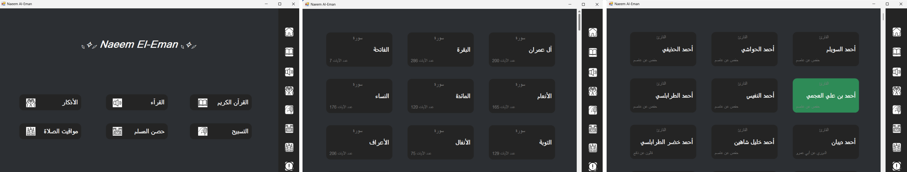
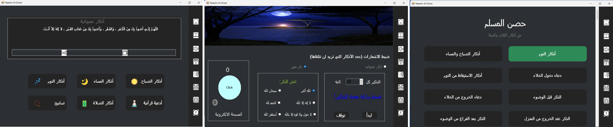
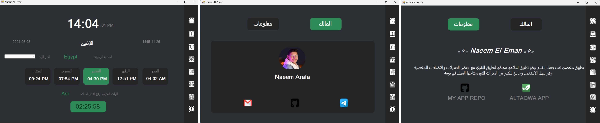
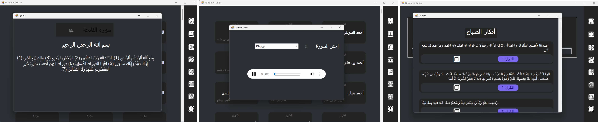

# Muslim-App-Naeem-Al-Eman

Muslim-App-Naeem-Al-Eman is designed to support and enhance the daily lives of Muslims by providing a comprehensive set of features aimed at fostering faith, knowledge, and community. This C# desktop application focuses on improving backend logic, using clean, readable, and reusable code, while connecting many files or forms together.

## Features

### Main Page
- Contains app pages and icons for navigation in the main and side sections of the app.

### Quran Page
- Contains the surahs of the Quran written out.
- Users can choose and read any surah they need.

### Reciters Page
- Contains a list of Quran reciters.
- Users can select a reciter and choose a surah to listen to.

### Adhkar Page
- Contains quick buttons for daily dhikr.
- Includes a box for a random dhikr.

### Praise Page
- Allows users to choose a random or specific dhikr to receive notifications.
- Contains an Electronic Rosary.

### Hisn Al-Muslim
- Contains most of the azkar a Muslim needs in life from the Quran and Sunnah.

### Prayers Page
- Displays the current day and time.
- Shows prayer times and the time until the next prayer.

### Info Page
- Contains information about the app and its owner.
- Provides links to contact the owner for issues or feedback.

## Screens:
<div style="display: flex;">
    <div style="flex: 50%; padding: 5px;">
        
    </div>
    <div style="flex: 50%; padding: 5px;">
        
    </div>
    <div style="flex: 50%; padding: 5px;">
        
    </div>
  <div style="flex: 50%; padding: 5px;">
        
    </div>
</div>

## Development Focus

This app was developed with a primary focus on backend logic and important concepts, rather than on the API or GUI aspects. The goal was to improve programming skills and enhance religious life through clean, maintainable code.

## Inspiration

The app simulates the functionality of the Taqwa app, with differences either by addition or subtraction. It is intended for personal use and does not compete with any other application.

## Getting Started

To clone the app to your device, follow these steps:

1. Clone the repository:
    ```bash
    git clone https://github.com/Naeem-Arafa/Muslim-App-Naeem-Al-Eman.git
    cd Muslim-App-Naeem-Al-Eman
    ```
2. Navigate to the project directory you want to explore.

## How to Fork the App

To fork the app repository, follow these steps:

1. **Go to the Repository on GitHub**: Navigate to the repository page on GitHub.
2. **Fork the Repository**: Click the "Fork" button at the top right of the page. This will create a copy of the repository under your GitHub account.
3. **Clone Your Fork**: Open a terminal or command prompt and run the following command, replacing `your-username` with your GitHub username:
    ```sh
    git clone https://github.com/your-username/Muslim-App-Naeem-Al-Eman.git
    ```
4. **Navigate to the Project Directory**: Change to the project directory:
    ```sh
    cd Muslim-App-Naeem-Al-Eman
    ```
5. **Open the Project**: Open the project in your preferred C# development environment (e.g., Visual Studio).


## Contact

For any issues or feedback, please refer to the Info Page within the app to find the appropriate contact links.

